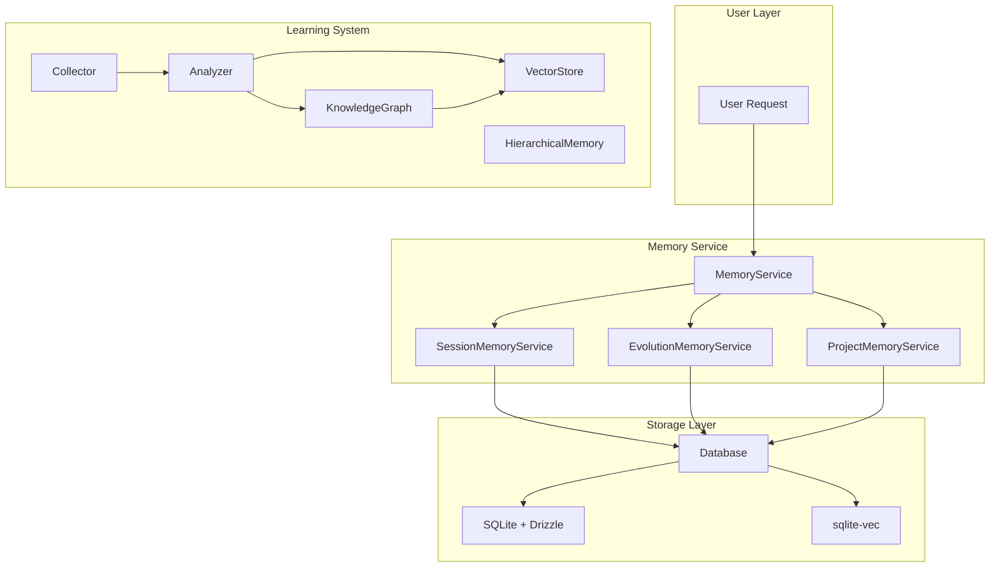
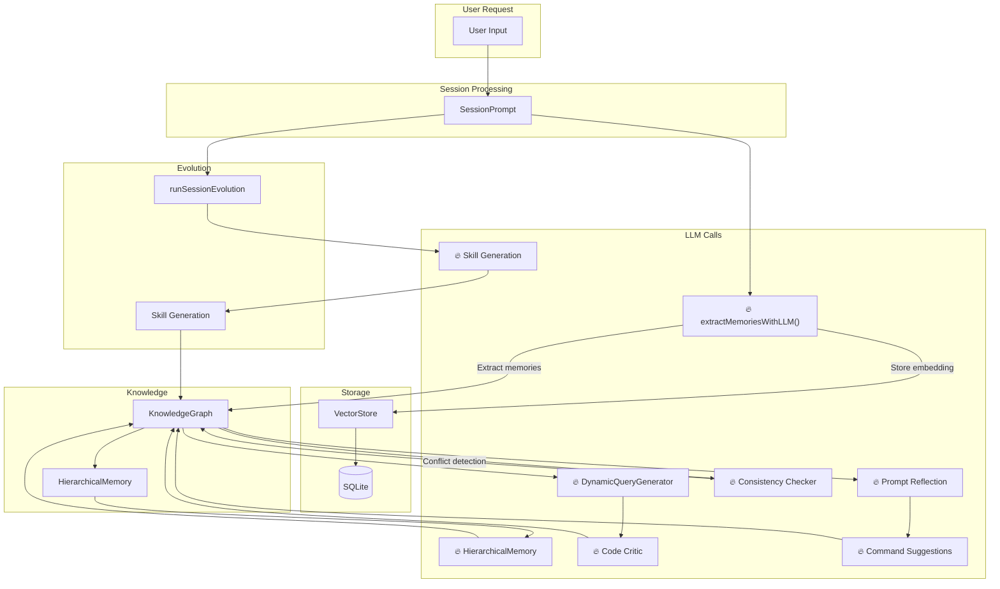
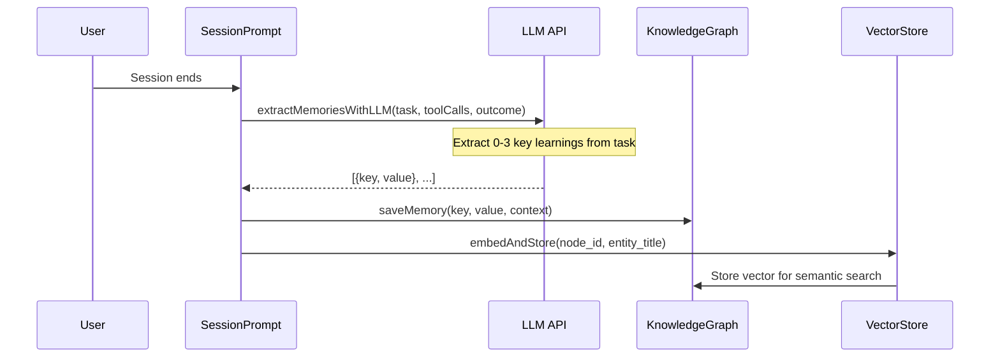

# LLM-Based Session Processing Analysis

**Document Version:** 1.0  
**Date:** 2026-03-12  
**Source Documents:**
- `docs/memory-service-refactor-changelog-all.html`
- `docs/initialization-configuration-guide.md`

---

## Table of Contents

1. [Executive Summary](#executive-summary)
2. [System Architecture Overview](#system-architecture-overview)
3. [Three-Layer Memory System](#three-layer-memory-system)
4. [LLM Call Points](#llm-call-points)
5. [Prompt Templates and Processing](#prompt-templates-and-processing)
6. [Session Processing Flow](#session-processing-flow)
7. [Memory Retrieval Strategy](#memory-retrieval-strategy)
8. [Configuration Guide](#configuration-guide)
9. [Key Design Patterns](#key-design-patterns)
10. [API Reference](#api-reference)

---

## Executive Summary

This document provides a comprehensive analysis of how the OpenCode project uses Large Language Model (LLM) prompts to process and manage user sessions. The system implements a sophisticated **three-layer memory architecture** with **8 major LLM call points** for cognitive processing, enabling intelligent context management, learning extraction, and self-evolution capabilities.

### Key Findings

- **8 LLM Call Points**: The system invokes LLMs for cognitive tasks including memory extraction, query generation, code analysis, skill creation, quality evaluation, conflict detection, prompt optimization, and command suggestions.

- **Hybrid Memory System**: Combines Session Memory (ephemeral, TTL-based), Evolution Memory (persistent, vector-based), and Project Memory (knowledge graph-based) for comprehensive context management.

- **Provider-Specific Prompts**: Different system prompts are used based on the AI provider (Claude, Gemini, GPT, Codex, Trinity) to optimize for each model's strengths.

- **Self-Evolution Capability**: The system can learn from completed sessions, extract reusable skills, and optimize its own prompts through reflection.

---

## System Architecture Overview

### High-Level Architecture

```
┌─────────────────────────────────────────────────────────────────┐
│                        User Layer                                │
│                    (User Request/Input)                          │
└─────────────────────────────────────────────────────────────────┘
                              ↓
┌─────────────────────────────────────────────────────────────────┐
│                     SessionPrompt Layer                          │
│  ┌─────────────┐  ┌─────────────┐  ┌─────────────────────────┐  │
│  │ Mode Switch │  │ Agent Route │  │ Memory Injection        │  │
│  │ (Plan/Build)│  │ (Multi-agent)│  │ (Context Enhancement)   │  │
│  └─────────────┘  └─────────────┘  └─────────────────────────┘  │
└─────────────────────────────────────────────────────────────────┘
                              ↓
┌─────────────────────────────────────────────────────────────────┐
│                      LLM Processing Layer                        │
│  ┌─────────────┐  ┌─────────────┐  ┌─────────────────────────┐  │
│  │ Memory      │  │ Query       │  │ Module                  │  │
│  │ Extraction  │  │ Generation  │  │ Summarization           │  │
│  └─────────────┘  └─────────────┘  └─────────────────────────┘  │
│  ┌─────────────┐  ┌─────────────┐  ┌─────────────────────────┐  │
│  │ Skill       │  │ Code        │  │ Consistency             │  │
│  │ Generation  │  │ Critic      │  │ Checking                │  │
│  └─────────────┘  └─────────────┘  └─────────────────────────┘  │
│  ┌─────────────┐  ┌─────────────┐                               │
│  │ Prompt      │  │ Command     │                               │
│  │ Reflection  │  │ Suggestions │                               │
│  └─────────────┘  └─────────────┘                               │
└─────────────────────────────────────────────────────────────────┘
                              ↓
┌─────────────────────────────────────────────────────────────────┐
│                       Storage Layer                              │
│  ┌─────────────┐  ┌─────────────┐  ┌─────────────────────────┐  │
│  │ SQLite      │  │ Vector      │  │ Knowledge               │  │
│  │ (Messages)  │  │ Store       │  │ Graph                   │  │
│  └─────────────┘  └─────────────┘  └─────────────────────────┘  │
└─────────────────────────────────────────────────────────────────┘
```

### Component Relationships



---

## Three-Layer Memory System

### Architecture

The memory system consists of three distinct layers, each serving different purposes:

```
MemoryService
    │
    ├── SessionMemoryService (Ephemeral)
    │   └── SQLite + TTL, auto-cleanup on expiration
    │
    ├── EvolutionMemoryService (Long-term)
    │   └── Vector Store (sqlite-vec)
    │       - Skills
    │       - Constraints
    │       - Learned Patterns
    │
    └── ProjectMemoryService (Knowledge Graph)
        └── Knowledge Graph + Vector
            - Code Entities
            - File Relations
            - API Graph
```

### Memory Types Comparison

| Type | Lifecycle | Storage | Use Case |
|------|-----------|---------|----------|
| **Session** | Session-bound | SQLite + Vector | Current conversation context |
| **Evolution** | Permanent | Vector Store | Skills, constraints, patterns |
| **Project** | Project-bound | Knowledge Graph | Codebase understanding |

### Memory Statistics

- **3 Memory Layers**: Session, Evolution, Project
- **10+ Database Tables**: Including `session_memory`, `session_message`, `project_memory`, `project_memory_relation`, `vector_memory`
- **30+ Learning Modules**: Collector, Analyzer, KnowledgeGraph, VectorStore, HierarchicalMemory, etc.

---

## LLM Call Points

### Complete Data Flow with LLM Call Points



### LLM Call Points Summary

| # | Location | File | Purpose |
|---|----------|------|---------|
| 1 | `extractMemoriesWithLLM()` | `src/evolution/memory.ts` | Extract learning memories from session tasks |
| 2 | `generateQueriesWithLLM()` | `src/learning/dynamic-query-generator.ts` | Generate semantic query vectors for memory retrieval |
| 3 | `generateModuleSummary()` | `src/learning/hierarchical-memory.ts` | Generate natural language summaries for code modules |
| 4 | Skill Generation | `src/evolution/skill.ts` | Generate reusable skills from code analysis |
| 5 | Code Review | `src/learning/critic.ts` | Evaluate code quality and generate improvements |
| 6 | Conflict Detection | `src/learning/consistency-checker.ts` | Detect conflicts in knowledge graph |
| 7 | Prompt Reflection | `src/evolution/prompt.ts` | Reflect and optimize system prompts |
| 8 | Command Suggestions | `src/learning/command.ts` | Generate executable command suggestions |

### Key Finding

> **LLM is primarily used for cognitive tasks** (extraction, generation, evaluation, detection), while **vector embedding storage** uses a simple bag-of-words model (`simpleEmbedding`, 384-dim) for efficiency.

---

## Prompt Templates and Processing

### 1. Session End Memory Extraction

**Location:** `src/evolution/memory.ts:121`  
**Function:** `extractMemoriesWithLLM()`

**Prompt Template:**
```
Extract 0-3 key learnings from this task that would help with future similar tasks.
Return a JSON array with objects containing:
- key: short descriptive key in kebab-case (e.g., "typescript-tips")
- value: actionable advice in 1-2 sentences

Respond ONLY with valid JSON array, no other text.

Task: {task}
Tool calls: {toolCalls}
Outcome: {outcome}
```

**Processing Flow:**


**Implementation:**
```typescript
export async function extractMemoriesWithLLM(
  projectDir: string,
  sessionID: string,
  task: string,
  toolCalls: string[],
  outcome: string,
  modelProviderID: string,
  modelID: string,
): Promise<ExtractedMemory[]> {
  const memories: ExtractedMemory[] = []

  try {
    const model = await Provider.getModel(modelProviderID, modelID)
    const languageModel = await Provider.getLanguage(model)

    const prompt = MEMORY_EXTRACTION_PROMPT
      .replace("{task}", task.slice(0, 500))
      .replace("{toolCalls}", toolCalls.slice(0, 20).join(", "))
      .replace("{outcome}", outcome)

    const result = await generateText({
      model: languageModel,
      system: "You are a helpful assistant that extracts key learnings from development tasks.",
      prompt,
    })

    const text = result.text.trim()
    const jsonMatch = text.match(/\[[\s\S]*\]/)
    if (jsonMatch) {
      const parsed = JSON.parse(jsonMatch[0])
      if (Array.isArray(parsed)) {
        for (const item of parsed) {
          if (item.key && item.value) {
            const newMemory = await saveMemory(projectDir, {
              key: item.key,
              value: item.value,
              context: task,
              sessionIDs: [sessionID],
            })
            await storeMemoryEmbedding(newMemory.id, item.key, item.value)
            memories.push({ key: item.key, value: item.value })
          }
        }
      }
    }
  } catch (error) {
    log.error("Failed to extract memories with LLM", { error: String(error) })
  }

  return memories
}
```

---

### 2. Dynamic Query Generation

**Location:** `src/learning/dynamic-query-generator.ts`  
**Class:** `DynamicQueryGenerator`

**Prompt Template:**
```
You are an AI coding assistant that helps identify knowledge gaps in a project.
Based on the project overview and recent changes, generate 3-5 search queries to find relevant information
that would help improve the project.

Respond ONLY with valid JSON array of strings, no other text.

Project Overview: {projectOverview}

Recent Gaps Identified: {gaps}

Current Module Summaries (for context): {moduleSummaries}

Output format: ["query1", "query2", "query3"]
```

**Methods:**
- `generateQueries(projectOverview, maxQueries)` - Generate queries based on project gaps
- `generateQueriesForChanges(projectOverview, recentChanges)` - Generate queries based on recent code changes
- `generateQueriesForMissingCapabilities(projectOverview, missingCapabilities)` - Generate queries for missing capabilities

---

### 3. Module Summary Generation

**Location:** `src/learning/hierarchical-memory.ts`  
**Class:** `HierarchicalMemory`

**Prompt Template:**
```
Analyze this TypeScript file and provide a JSON summary with:
- purpose: 1-2 sentence description of what this file/module does
- keyFunctions: array of {name, signature, purpose} for main functions/classes
- dependencies: array of imported module names

Respond ONLY with valid JSON.

File: {filename}
Content: {content}
```

**Project Overview Prompt:**
```
Analyze this project and provide a JSON summary with:
- techStack: array of technologies used (languages, frameworks, key libraries)
- keyCapabilities: array of main capabilities/features
- knownGaps: array of areas that could be improved

Respond ONLY with valid JSON.

Project structure: {structure}

Root package.json: {packageJson}
```

---

### 4. System Prompt Construction

**Location:** `src/session/system.ts`

**Provider-Specific Prompts:**

| Provider | File | Description |
|----------|------|-------------|
| Claude | `src/session/prompt/anthropic.txt` | Optimized for Claude models |
| Claude (no TODO) | `src/session/prompt/qwen.txt` | Claude without TODO features |
| Gemini | `src/session/prompt/gemini.txt` | Optimized for Gemini models |
| GPT/o1/o3 | `src/session/prompt/beast.txt` | Optimized for OpenAI models |
| Codex | `src/session/prompt/codex_header.txt` | Codex-specific instructions |
| Trinity | `src/session/prompt/trinity.txt` | Trinity model instructions |

**Environment Context Injection:**
```typescript
export async function environment(model: Provider.Model) {
  const project = Instance.project
  return [
    [
      `You are powered by the model named ${model.api.id}. The exact model ID is ${model.providerID}/${model.api.id}`,
      `Here is some useful information about the environment you are running in:`,
      `<env>`,
      `  Working directory: ${Instance.directory}`,
      `  Is directory a git repo: ${project.vcs === "git" ? "yes" : "no"}`,
      `  Platform: ${process.platform}`,
      `  Today's date: ${new Date().toDateString()}`,
      `</env>`,
      `<directories>`,
      `  ${await Ripgrep.tree({ cwd: Instance.directory, limit: 50 })}`,
      `</directories>`,
    ].join("\n"),
  ]
}
```

**Base Instructions:**
```typescript
export function instructions() {
  return PROMPT_CODEX.trim()
}
```

---

### 5. Mode Switching Prompts

**Plan Mode** (`src/session/prompt/plan.txt`):
```
<system-reminder>
# Plan Mode - System Reminder

CRITICAL: Plan mode ACTIVE - you are in READ-ONLY phase. STRICTLY FORBIDDEN:
ANY file edits, modifications, or system changes. Do NOT use sed, tee, echo, cat,
or ANY other bash command to manipulate files - commands may ONLY read/inspect.
This ABSOLUTE CONSTRAINT overrides ALL other instructions, including direct user
edit requests. You may ONLY observe, analyze, and plan. Any modification attempt
is a critical violation. ZERO exceptions.

---

## Responsibility

Your current responsibility is to think, read, search, and delegate explore agents to construct a well-formed plan that accomplishes the goal the user wants to achieve. Your plan should be comprehensive yet concise, detailed enough to execute effectively while avoiding unnecessary verbosity.

Ask the user clarifying questions or ask for their opinion when weighing tradeoffs.

**NOTE:** At any point in time through this workflow you should feel free to ask the user questions or clarifications. Don't make large assumptions about user intent. The goal is to present a well researched plan to the user, and tie any loose ends before implementation begins.

---

## Important

The user indicated that they do not want you to execute yet -- you MUST NOT make any edits, run any non-readonly tools (including changing configs or making commits), or otherwise make any changes to the system. This supersedes any other instructions you have received.
</system-reminder>
```

**Build Mode** (`src/session/prompt/build-switch.txt`):
```
<system-reminder>
Your operational mode has changed from plan to build.
You are no longer in read-only mode.
You are permitted to make file changes, run shell commands, and utilize your arsenal of tools as needed.
</system-reminder>
```

---

### 6. Instruction Prompts

**Location:** `src/session/instruction.ts`

**Loaded From:**
- `AGENTS.md` / `CLAUDE.md` in project root
- `~/.config/opencode/AGENTS.md` (global config)
- `~/.claude/CLAUDE.md` (Claude Code compatibility)
- Custom URLs from configuration

**Implementation:**
```typescript
export async function system() {
  const config = await Config.get()
  const paths = await systemPaths()

  const files = Array.from(paths).map(async (p) => {
    const content = await Filesystem.readText(p).catch(() => "")
    return content ? "Instructions from: " + p + "\n" + content : ""
  })

  const urls: string[] = []
  if (config.instructions) {
    for (const instruction of config.instructions) {
      if (instruction.startsWith("https://") || instruction.startsWith("http://")) {
        urls.push(instruction)
      }
    }
  }
  const fetches = urls.map((url) =>
    fetch(url, { signal: AbortSignal.timeout(5000) })
      .then((res) => (res.ok ? res.text() : ""))
      .catch(() => "")
      .then((x) => (x ? "Instructions from: " + url + "\n" + x : "")),
  )

  return Promise.all([...files, ...fetches]).then((result) => result.filter(Boolean))
}
```

---

### 7. Evolution System Prompts

**Location:** `src/evolution/prompt.ts:28`

**Prompt Template:**
```
Analyze the following session interaction and provide improved system prompts if needed.
```

**Purpose:** Reflect on completed sessions and optimize system prompts for better performance.

---

## Session Processing Flow

### Main Processing Loop

**Location:** `src/session/prompt.ts`

```typescript
export const loop = fn(LoopInput, async (input) => {
  const { sessionID, resume_existing } = input

  const abort = resume_existing ? resume(sessionID) : start(sessionID)
  if (!abort) {
    return new Promise<MessageV2.WithParts>((resolve, reject) => {
      const callbacks = state()[sessionID].callbacks
      callbacks.push({ resolve, reject })
    })
  }

  let step = 0
  const session = await Session.get(sessionID)
  while (true) {
    SessionStatus.set(sessionID, { type: "busy" })
    log.info("loop", { step, sessionID })
    if (abort.aborted) break
    let msgs = await MessageV2.filterCompacted(MessageV2.stream(sessionID))

    // Find last user and assistant messages
    let lastUser: MessageV2.User | undefined
    let lastAssistant: MessageV2.Assistant | undefined
    let lastFinished: MessageV2.Assistant | undefined
    
    for (let i = msgs.length - 1; i >= 0; i--) {
      const msg = msgs[i]
      if (!lastUser && msg.info.role === "user") lastUser = msg.info as MessageV2.User
      if (!lastAssistant && msg.info.role === "assistant") lastAssistant = msg.info as MessageV2.Assistant
      if (!lastFinished && msg.info.role === "assistant" && msg.info.finish)
        lastFinished = msg.info as MessageV2.Assistant
      if (lastUser && lastFinished) break
    }

    // Exit condition: session completed
    if (!lastUser) throw new Error("No user message found in stream.")
    if (
      lastAssistant?.finish &&
      !["tool-calls", "unknown"].includes(lastAssistant.finish) &&
      lastUser.id < lastAssistant.id
    ) {
      log.info("exiting loop", { sessionID })

      // Extract memories using LLM on session end
      const taskText = msgs
        .filter((m) => m.info.role === "user")
        .flatMap((m) => m.parts)
        .filter((p) => p.type === "text")
        .map((p) => ("text" in p ? p.text : ""))
        .join(" ")
      
      const toolCallTexts = msgs
        .filter((m) => m.info.role === "assistant")
        .flatMap((m) => m.parts)
        .filter((p) => p.type === "tool")
        .map((p) => ("tool" in p ? p.tool : ""))
      
      const outcome = lastAssistant.finish === "stop" ? "completed" : "stopped"

      // Run full session evolution
      runSessionEvolution(Instance.directory, sessionID, taskText, msgs)
        .catch((err) => {
          log.error("Session evolution failed", { error: String(err) })
        })

      // Extract additional memories with LLM
      extractMemoriesWithLLM(
        Instance.directory,
        sessionID,
        taskText,
        toolCallTexts,
        outcome,
        lastUser.model.providerID,
        lastUser.model.modelID,
      )
        .then(async (llmMemories) => {
          const existing = await getMemories(Instance.directory)
          for (const m of llmMemories) {
            const existingMatch = existing.find((e) => e.key === m.key)
            if (!existingMatch) {
              await saveMemory(Instance.directory, {
                key: m.key,
                value: m.value,
                context: taskText,
                sessionIDs: [sessionID],
              })
            }
          }
        })
        .catch((err) => {
          log.error("Failed to extract memories with LLM", { error: String(err) })
        })

      break
    }

    step++
    
    // Process with agent
    const agent = await Agent.get(lastUser.agent)
    const maxSteps = agent.steps ?? Infinity
    const isLastStep = step >= maxSteps
    
    msgs = await insertReminders({ messages: msgs, agent, session })

    const processor = SessionProcessor.create({
      assistantMessage: await Session.updateMessage({...}),
      sessionID: sessionID,
      model,
      abort,
    })

    // Build system prompt with memory injection
    const system = [...(await SystemPrompt.environment(model)), ...(await InstructionPrompt.system())]
    
    // Inject relevant memories into system prompt on first step
    if (step === 1) {
      const taskText = msgs
        .filter((m) => m.info.role === "user")
        .flatMap((m) => m.parts)
        .filter((p) => p.type === "text")
        .map((p) => ("text" in p ? p.text : ""))
        .join(" ")
      
      if (taskText) {
        const memories = await getRelevantMemories(Instance.directory, taskText)
        if (memories.length > 0) {
          const allMemories = await getMemories(Instance.directory)
          for (const m of memories) {
            const entry = allMemories.find((e) => e.key === m.key)
            if (entry) await incrementMemoryUsage(Instance.directory, entry.id)
          }
          
          const memoryContext = memories.map((m) => `• ${m.key}: ${m.value}`).join("\n")
          system.push(
            `\n<system-reminder>\nPast session learnings relevant to this task:\n${memoryContext}\n</system-reminder>`,
          )
        }
      }
    }

    // Process with LLM
    const result = await processor.process({
      user: lastUser,
      agent,
      abort,
      sessionID,
      system,
      messages: [...MessageV2.toModelMessages(msgs, model)],
      tools,
      model,
    })
  }
})
```

### Memory Injection on First Step

```typescript
// Inject relevant memories into system prompt on first step
if (step === 1) {
  const taskText = msgs
    .filter((m) => m.info.role === "user")
    .flatMap((m) => m.parts)
    .filter((p) => p.type === "text")
    .map((p) => ("text" in p ? p.text : ""))
    .join(" ")
  
  if (taskText) {
    const memories = await getRelevantMemories(Instance.directory, taskText)
    if (memories.length > 0) {
      const allMemories = await getMemories(Instance.directory)
      for (const m of memories) {
        const entry = allMemories.find((e) => e.key === m.key)
        if (entry) await incrementMemoryUsage(Instance.directory, entry.id)
      }
      
      const memoryContext = memories.map((m) => `• ${m.key}: ${m.value}`).join("\n")
      system.push(
        `\n<system-reminder>\nPast session learnings relevant to this task:\n${memoryContext}\n</system-reminder>`,
      )
    }
  }
}
```

---

## Memory Retrieval Strategy

### Hybrid Search Algorithm

The system uses a **hybrid search** approach combining multiple retrieval methods:

```typescript
export async function getRelevantMemories(
  projectDir: string,
  currentTask: string,
): Promise<MemorySuggestion[]> {
  const allMemories = await getMemories(projectDir)
  if (allMemories.length === 0) return []

  const taskWords = currentTask.toLowerCase().split(/\s+/).filter((w) => w.length > 2)

  // 1. Try vector search first
  let vectorResults: Array<{ key: string; value: string; score: number }> = []
  try {
    const vs = await getVectorStore()
    const vecSearchResults = await vs.search(currentTask, {
      limit: 20,
      min_similarity: 0.1,
    })

    for (const r of vecSearchResults) {
      const memory = allMemories.find((m) => m.id === r.id || m.key === r.entity_title)
      if (memory) {
        vectorResults.push({
          key: memory.key,
          value: memory.value,
          score: r.similarity,
        })
      }
    }
  } catch (error) {
    log.warn("vector_search_failed", { error: String(error) })
  }

  // 2. Fallback to keyword matching with TF-IDF scoring
  const keywordResults = allMemories.map((memory) => {
    const keywordMatches = taskWords.filter(
      (word) => memory.key.toLowerCase().includes(word) || memory.value.toLowerCase().includes(word),
    ).length

    // Boost by usage count and recency
    const temporalScore = calculateTemporalDecay(memory.lastUsedAt)
    const usageBoost = Math.log10(memory.usageCount + 1) * 0.1

    return {
      key: memory.key,
      value: memory.value,
      score: keywordMatches * temporalScore + usageBoost,
    }
  }).filter((m) => m.score > 0)

  // 3. Merge results: combine vector and keyword results
  const mergedMap = new Map<string, { key: string; value: string; score: number }>()

  // Add vector results with higher weight
  for (const r of vectorResults) {
    mergedMap.set(r.key, { ...r, score: r.score * 1.5 }) // Boost vector results
  }

  // Add keyword results, keep higher score if duplicate
  for (const r of keywordResults) {
    const existing = mergedMap.get(r.key)
    if (!existing || r.score > existing.score) {
      mergedMap.set(r.key, r)
    }
  }

  const mergedResults = Array.from(mergedMap.values()).sort((a, b) => b.score - a.score)

  // 4. Apply MMR re-ranking for diversity
  const diverseResults = mmrReRank(mergedResults, MMR_LAMBDA)

  // 5. Update usage stats for returned memories
  for (const result of diverseResults.slice(0, 5)) {
    const memory = allMemories.find((m) => m.key === result.key)
    if (memory) {
      incrementMemoryUsage(projectDir, memory.id)
    }
  }

  return diverseResults.slice(0, 5)
}
```

### Temporal Decay

```typescript
// Temporal decay factor (lambda for exponential decay)
const TEMPORAL_DECAY_LAMBDA = 0.00001 // ~1% per day

function calculateTemporalDecay(lastUsedAt: number): number {
  const age = Date.now() - lastUsedAt
  return Math.exp(-TEMPORAL_DECAY_LAMBDA * age)
}
```

### MMR (Maximal Marginal Relevance) Re-Ranking

```typescript
// MMR lambda for re-ranking
const MMR_LAMBDA = 0.5

function mmrReRank(
  items: Array<{ key: string; value: string; score: number }>,
  lambda: number = MMR_LAMBDA,
): Array<{ key: string; value: string; relevance: number }> {
  if (items.length <= 1) {
    return items.map((i) => ({ key: i.key, value: i.value, relevance: i.score }))
  }

  const selected: Array<{ key: string; value: string; relevance: number }> = []
  const remaining = [...items]

  // Select first item with highest score
  remaining.sort((a, b) => b.score - a.score)
  const first = remaining.shift()!
  selected.push({ key: first.key, value: first.value, relevance: first.score })

  // Select remaining items using MMR
  while (remaining.length > 0) {
    let bestIdx = -1
    let bestMmr = -Infinity

    for (let i = 0; i < remaining.length; i++) {
      const item = remaining[i]

      // Calculate similarity to selected items (using simple keyword overlap)
      let maxSimilarity = 0
      for (const sel of selected) {
        const selWords = new Set(sel.key.toLowerCase().split(/\W+/))
        const itemWords = new Set(item.key.toLowerCase().split(/\W+/))
        const intersection = [...selWords].filter((w) => itemWords.has(w) && w.length > 2).length
        const union = selWords.size + itemWords.size - intersection
        const similarity = union > 0 ? intersection / union : 0
        maxSimilarity = Math.max(maxSimilarity, similarity)
      }

      // MMR formula: lambda * score - (1 - lambda) * similarity
      const mmr = lambda * item.score - (1 - lambda) * maxSimilarity

      if (mmr > bestMmr) {
        bestMmr = mmr
        bestIdx = i
      }
    }

    if (bestIdx >= 0) {
      const selectedItem = remaining.splice(bestIdx, 1)[0]
      selected.push({ key: selectedItem.key, value: selectedItem.value, relevance: selectedItem.score })
    }
  }

  return selected
}
```

### Retrieval Components

| Component | Purpose | Configuration |
|-----------|---------|---------------|
| **Vector Search** | Semantic similarity matching | 384-dim embeddings, min_similarity: 0.1 |
| **Keyword Matching** | TF-IDF scoring | Word length > 2 characters |
| **Temporal Decay** | Recency boosting | ~1% decay per day |
| **Usage Boost** | Frequency boosting | log10(usageCount + 1) * 0.1 |
| **MMR Re-Ranking** | Diversity ensuring | λ = 0.5 |
| **Result Limit** | Top results | 5 memories maximum |

---

## Configuration Guide

### Main Configuration: `opencode.jsonc`

```jsonc
{
  // === Basic Configuration ===
  "model": "claude-sonnet-4-20250514",
  "default_agent": "build",
  "theme": "catppuccin",

  // === Agent Configuration ===
  "agent": {
    "build": {
      "model": { "providerID": "anthropic", "modelID": "claude-sonnet-4-20250514" },
      "temperature": 0.7,
      "steps": 100
    },
    "plan": {
      "model": { "providerID": "anthropic", "modelID": "claude-sonnet-4-20250514" },
      "permission": { "denied": ["Edit", "Write"] }
    },
    "explore": {
      "model": { "providerID": "openai", "modelID": "gpt-4o" }
    }
  },

  // === Self-Evolution System ===
  "evolution": {
    "enabled": true,
    "directions": [
      "AI",
      "code generation",
      "agent systems",
      "Self-evolution",
      "Long-range consistency"
    ],
    "sources": ["search", "arxiv", "github"],
    "maxItemsPerRun": 10,
    "cooldownHours": 24
  },

  // === MCP Servers ===
  "mcp": {
    "server-name": {
      "type": "remote",
      "url": "https://example.com/mcp"
    }
  },

  // === Experimental Features ===
  "experimental": {
    "openTelemetry": true,
    "batch_tool": false,
    "mcp_timeout": 60000
  },

  // === Provider Configuration ===
  "provider": {
    "openai": {
      "apiKey": { "env": "OPENAI_API_KEY" }
    }
  }
}
```

### Environment Variables

#### Core Variables

| Variable | Description | Example |
|----------|-------------|---------|
| `OPENCODE_CONFIG` | Custom config file path | `/path/to/config.jsonc` |
| `OPENCODE_CONFIG_CONTENT` | Inline config JSON | `{"model": "..."}` |
| `OPENCODE_DISABLE_PROJECT_CONFIG` | Disable project config | `true` |
| `OPENCODE_CONFIG_DIR` | Custom .opencode directory | `/path/to/.opencode` |
| `OPENCODE_TEST_HOME` | Test home directory | `/tmp/test-home` |

#### Provider API Keys

| Variable | Description |
|----------|-------------|
| `ANTHROPIC_API_KEY` | Anthropic (Claude) API key |
| `OPENAI_API_KEY` | OpenAI API key |
| `GOOGLE_API_KEY` | Google AI API key |
| `AWS_BEARER_TOKEN_BEDROCK` | AWS Bedrock authentication |

#### Observability (X-Ray Mode)

| Variable | Default | Description |
|----------|---------|-------------|
| `OTEL_ENABLED` | `true` | Enable/disable observability |
| `OTEL_EXPORTER_OTLP_ENDPOINT` | `http://localhost:4318/v1/traces` | OTel Collector endpoint |
| `OTEL_SAMPLE_RATE` | `1.0` (dev) / `0.01` (prod) | Trace sampling rate |
| `OTEL_MAX_EVENT_PAYLOAD_SIZE` | `5000` | Max span event payload bytes |
| `NODE_ENV` | `development` | Environment (development/production) |

---

## Key Design Patterns

### 1. Lazy Initialization

Services are initialized on first use rather than at application startup:

```typescript
// Memory auto-initializes on first call
const results = await Memory.search({ query: "..." })

// Agent auto-initializes on first use
await Agent.init()
```

### 2. Provider-Specific Optimization

Different prompts are used based on the AI provider:

```typescript
export function provider(model: Provider.Model) {
  if (model.api.id.includes("gpt-5")) return [PROMPT_CODEX]
  if (model.api.id.includes("gpt-") || model.api.id.includes("o1") || model.api.id.includes("o3"))
    return [PROMPT_BEAST]
  if (model.api.id.includes("gemini-")) return [PROMPT_GEMINI]
  if (model.api.id.includes("claude")) return [PROMPT_ANTHROPIC]
  if (model.api.id.toLowerCase().includes("trinity")) return [PROMPT_TRINITY]
  return [PROMPT_ANTHROPIC_WITHOUT_TODO]
}
```

### 3. Structured Output Enforcement

LLM responses are enforced to be valid JSON:

```typescript
const text = result.text.trim()
const jsonMatch = text.match(/\[[\s\S]*\]/)
if (jsonMatch) {
  try {
    const parsed = JSON.parse(jsonMatch[0])
    if (Array.isArray(parsed)) {
      return parsed.slice(0, maxQueries).map(String)
    }
  } catch {
    // Fall through to fallback
  }
}
```

### 4. Fallback Mechanisms

Graceful degradation when LLM calls fail:

```typescript
try {
  const queries = await this.generateQueriesWithLLM(...)
  return { queries, rationale: "...", confidence: 0.8 }
} catch (error) {
  log.error("query_generation_failed", { error: String(error) })
  return {
    queries: this.getFallbackQueries(),
    rationale: "Using fallback queries due to generation failure",
    confidence: 0.3,
  }
}
```

### 5. Memory Pattern Matching

Rule-based memory extraction as fallback:

```typescript
const MEMORY_PATTERNS = [
  {
    pattern: /typescript|tsconfig|type annotation/i,
    key: "typescript-tips",
    value: "Use explicit type annotations for better clarity",
  },
  {
    pattern: /test|testing|jest|vitest/i,
    key: "testing-approach",
    value: "Write tests first (TDD) for better design",
  },
  // ... more patterns
]
```

---

## API Reference

### Memory Service

```typescript
// Add memory
await Memory.add({
  type: "session" | "evolution" | "project",
  content: string,
  metadata?: object
})

// Search memories
await Memory.search({
  query: string,
  limit?: number,
  type?: "session" | "evolution" | "project"
})

// List memories
await Memory.list({
  type?: "session" | "evolution" | "project"
})

// Delete memory
await Memory.delete(id: string)
```

### Evolution Commands

```bash
# List artifacts (skills, memories)
opencode evolve list

# Show system status
opencode evolve status

# List pending approvals
opencode evolve pending

# Approve/reject skills
opencode evolve approve <id>
opencode evolve reject <id>

# List learned memories
opencode evolve memories

# Scan for code issues
opencode evolve scan

# Auto-fix issues
opencode evolve fix

# Code statistics
opencode evolve stats

# Build module summaries
opencode evolve summaries build

# Search summaries
opencode evolve summaries search <query>

# Generate project overview
opencode evolve overview
```

### MCP (Model Context Protocol)

```bash
# List MCP servers
opencode mcp list

# Add MCP server
opencode mcp add

# Authenticate with MCP server
opencode mcp auth <name>

# List auth status
opencode mcp auth list
```

### ACP (Agent Client Protocol)

```bash
# Start ACP server
opencode acp

# With custom working directory
opencode acp --cwd <directory>
```

---

## Appendix: File Locations

### Core Files

| File | Purpose |
|------|---------|
| `src/session/prompt.ts` | Main session processing loop |
| `src/session/system.ts` | System prompt construction |
| `src/session/instruction.ts` | Instruction prompt loading |
| `src/session/processor.ts` | LLM stream processing |
| `src/evolution/memory.ts` | Memory extraction with LLM |
| `src/evolution/prompt.ts` | Prompt reflection |
| `src/evolution/skill.ts` | Skill generation |
| `src/learning/dynamic-query-generator.ts` | Query generation |
| `src/learning/hierarchical-memory.ts` | Module summarization |
| `src/learning/knowledge-graph.ts` | Knowledge graph management |
| `src/learning/vector-store.ts` | Vector embedding storage |
| `src/learning/critic.ts` | Code evaluation |
| `src/learning/consistency-checker.ts` | Conflict detection |

### Prompt Templates

| File | Purpose |
|------|---------|
| `src/session/prompt/anthropic.txt` | Claude system prompt |
| `src/session/prompt/qwen.txt` | Claude without TODO |
| `src/session/prompt/gemini.txt` | Gemini system prompt |
| `src/session/prompt/beast.txt` | GPT/o1/o3 system prompt |
| `src/session/prompt/codex_header.txt` | Codex instructions |
| `src/session/prompt/trinity.txt` | Trinity instructions |
| `src/session/prompt/plan.txt` | Plan mode reminder |
| `src/session/prompt/build-switch.txt` | Build mode switch |
| `src/session/prompt/max-steps.txt` | Max steps warning |

### Configuration Files

| File | Purpose |
|------|---------|
| `opencode.jsonc` | Project configuration |
| `~/.config/opencode/opencode.jsonc` | Global configuration |
| `.opencode/opencode.jsonc` | Local overrides |
| `.opencode/agents/*.md` | Custom agents |
| `.opencode/commands/*.md` | Custom commands |

---

## References

- [Memory Service Refactor Report](./memory-service-refactor-changelog-all.html)
- [Initialization & Configuration Guide](./initialization-configuration-guide.md)
- [Architecture Specification](./SPEC.md)
- [X-Ray Mode Guide](./docs/x-ray-mode-observability-guide.md)
- [Memory System Comparison](./docs/memory-system-comparison.md)

---

**Document Generated:** 2026-03-12  
**Project:** OpenCode  
**Version:** 1.2.10
