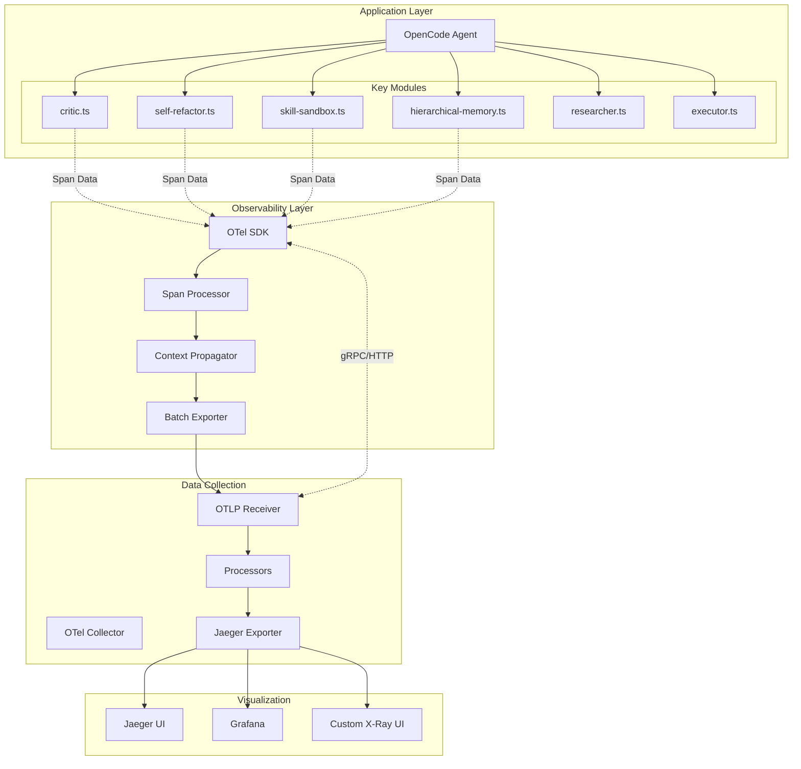
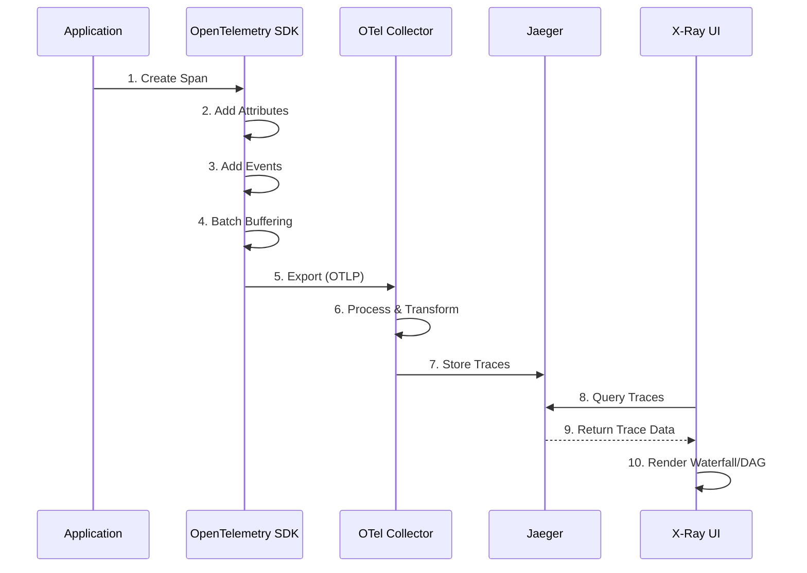
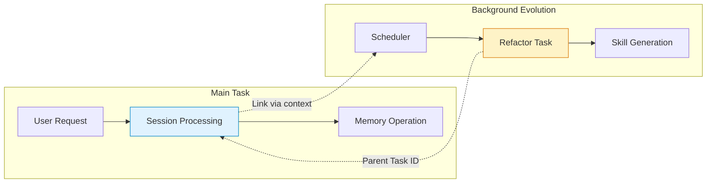
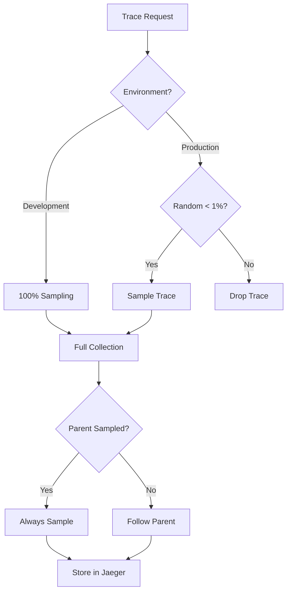

# X-Ray Mode Observability System

## Architecture Overview



## Data Flow



## Context Propagation



## Quick Start

### 1. Start Observability Stack

```bash
cd deploy/observability
docker-compose up -d
```

Services:
- Jaeger UI: http://localhost:16686
- Grafana: http://localhost:3000
- OTel Collector: http://localhost:4318

### 2. Configure Environment

```bash
# Enable OpenTelemetry
export OTEL_ENABLED=true
export OTEL_EXPORTER_OTLP_ENDPOINT=http://localhost:4318/v1/traces

# Development mode (100% sampling)
export NODE_ENV=development

# Or production with 1% sampling
export NODE_ENV=production
export OTEL_SAMPLE_RATE=0.01
```

### 3. Initialize in Code

```typescript
import { initObservability } from "./observability"

initObservability({
  serviceName: "opencode-agent",
  serviceVersion: "1.0.0",
  environment: process.env.NODE_ENV || "development",
})
```

## User Stories

### Story 1: Debug Self-Refactor Failure

**Scenario**: "I want to see why the self-refactoring failed"

**Steps**:

1. **Open Dashboard**
   ```bash
   # Access Jaeger UI
   open http://localhost:16686
   ```

2. **Filter Traces**
   - Select **Service** dropdown: `opencode-agent`
   - Select **Operation** dropdown: `agent.evolution.refactor`
   - Or leave Operation as "all" to see all operations
   - Look for traces with status `error` (red)
   
   **Note**: Do NOT type span names directly into the browser URL. Jaeger's `/api/traces/{id}` endpoint requires a hexadecimal trace ID, not a span name. Use the UI dropdowns instead.

3. **Click Error Node**
   - Find the red span `agent.evolution.refactor`
   - Click to view details

4. **View Security Interception**
   - Look for event: `security.interception`
   - See the reason: e.g., "Security policy violation: blocked pattern..."

5. **View Rollback Details**
   - Event: `rollback.reason`
   - Check if snapshot was restored

**Result**: You see the exact security policy violation that triggered the rollback.

---

### Story 2: Trace Memory Retrieval

**Scenario**: "I want to see what memories were retrieved for a task"

**Steps**:

1. **Filter by Memory Operation**
   - In Jaeger UI, select Service: `opencode-agent`
   - Select Operation: `agent.memory.operation`

2. **Find the Relevant Trace**
   - Look for `SEARCH` operation type
   - Check `context.taskId` matches your task

3. **View Retrieved Memories**
   - Span event: `retrieved.ids`
   - Shows IDs of matched memories
   - Attribute: `results.count`

4. **View Query Embedding**
   - Attribute: `query.embedding.hash`
   - Latency: `latency.ms`

**Result**: You understand exactly which memories were retrieved and why.

---

### Story 3: Analyze Critic Decision

**Scenario**: "Why did the Critic reject my code proposal?"

**Steps**:

1. **Find the Evaluation**
   - In Jaeger UI, select Service: `opencode-agent`
   - Select Operation: `agent.critic.evaluate`

2. **View Decision**
   - Attribute: `decision.outcome` = FAIL/MODIFY
   - Attribute: `score.value`
   - Compare to: `score.threshold`

3. **View Reasoning**
   - Event: `reasoning.steps`
   - Shows the LLM's chain-of-thought

4. **View Suggestions**
   - Event: `suggestion.diff`
   - Shows what changes were recommended

5. **View Risks**
   - Event: `evaluation.risks`
   - Lists identified risk factors

**Result**: You see the exact reasoning behind the rejection.

---

### Story 4: Compare Before/After Rollback

**Scenario**: "What was the difference between the attempted refactor and rollback?"

**Steps**:

1. **Enable Compare Mode** (in custom UI)
   - Click "Compare Mode" button

2. **Select Two Traces**
   - Choose: Failed refactor trace
   - Choose: Rollback trace

3. **View Side-by-Side**
   - Left: Code before (snapshot ID)
   - Right: Code after (snapshot ID)
   - Diff: `changes.count`, `changes.additions`, `changes.deletions`

4. **Highlight Differences**
   - Red: Code that was removed
   - Green: Code that was added

**Result**: You see exactly what changed and what was reverted.

---

### Story 5: Track LLM Costs

**Scenario**: "How much did the Critic's LLM calls cost?"

**Steps**:

1. **Find Critic Span**
   - In Jaeger UI, select Service: `opencode-agent`
   - Select Operation: `agent.critic.evaluate`

2. **View LLM Metrics**
   - Attribute: `llm.provider` (e.g., "openai")
   - Attribute: `llm.model` (e.g., "gpt-4")
   - Attribute: `llm.input_tokens`
   - Attribute: `llm.output_tokens`
   - Attribute: `llm.latency.ms`

3. **Calculate Cost**
   ```typescript
   const inputCost = inputTokens * 0.03 / 1000  // $0.03 per 1K tokens
   const outputCost = outputTokens * 0.06 / 1000 // $0.06 per 1K tokens
   const total = inputCost + outputCost
   ```

**Result**: You see token usage and can estimate costs.

---

### Story 6: Trace Data Lineage

**Scenario**: "Which Critic decision created this memory?"

**Steps**:

1. **Find the Memory**
   - Search for memory in your app
   - Note the memory ID

2. **Query in Jaeger**
   - In Jaeger UI Tags search field: `memory.source_span_id=*`
   - Or filter by tag: `memory.retrieved_source_span_ids` contains the memory ID

3. **View Lineage Attributes**
   - Attribute: `memory.source_span_id` = "abc123..."
   - Attribute: `memory.source_trace_id` = "def456..."

4. **Navigate to Parent Trace**
   - Click the trace ID
   - See the full context: which Critic, which decision, which code

**Result**: You can trace any memory back to its creator operation.

---

### Story 7: Debug Background Task Context

**Scenario**: "Why are my scheduled refactor tasks not linked to the main trace?"

**Steps**:

1. **Find Background Task**
   - In Jaeger UI Tags search field: `background.task=true`
   - Or search by Operation starting with: `scheduler.`

2. **Check Parent Link**
   - Attribute: `background.parent_trace_id`
   - Attribute: `background.parent_span_id`
   - If missing, context was not propagated

3. **Verify in Code**
   ```typescript
   // Use scheduler middleware
   const scheduler = createSchedulerMiddleware()
   await scheduler.scheduleTask("refactor", { taskId, taskType }, fn)
   
   // Or manual injection
   const carrier = traceUtils.injectContext()
   setImmediate(() => traceUtils.runWithContext(fn))
   ```

4. **Check for setTimeout/setImmediate**
   - These lose context automatically
   - Use `traceUtils.bindCallback()` to preserve

**Result**: You can identify and fix context propagation issues in background tasks.

---

## Configuration

### Environment Variables

| Variable | Default | Description |
|----------|---------|-------------|
| `OTEL_ENABLED` | `true` | Enable/disable observability |
| `OTEL_EXPORTER_OTLP_ENDPOINT` | `http://localhost:4318/v1/traces` | OTel Collector endpoint |
| `OTEL_SAMPLE_RATE` | `1.0` (dev) / `0.01` (prod) | Trace sampling rate |
| `OTEL_MAX_EVENT_PAYLOAD_SIZE` | `5000` | Max characters for Span Events (truncation threshold) |
| `NODE_ENV` | `development` | Environment name |
| `EMBEDDING_DIM` | `384` | Vector dimension |

### Sampling Strategy



### Data Sanitization

The system automatically filters sensitive data:

```typescript
const SENSITIVE_KEYS = [
  "api_key",
  "secret", 
  "password",
  "token",
  "authorization",
  "credential",
  "private_key",
  "access_token",
  "refresh_token",
]
```

All matching attributes are replaced with `[REDACTED]` before export.

### Smart Truncation & External Storage

To prevent Span bloat from large prompts/code, the system automatically truncates content:

**Truncation Strategy:**
- First 500 characters + Last 200 characters
- Middle section replaced with: `... [N chars, hash: abc123... ] ...`
- SHA-256 hash stored for full content verification

**External Storage (for very large content > 5000 chars):**
- Content stored to `/tmp/otel_content/<prefix>_<hash>.txt`
- Only hash and file path stored in Span
- Enables debugging without payload explosion

```typescript
import { SPAN_CONFIG, smartTruncate, storeContentExternal } from "./observability/spans"

// Manual usage
const result = smartTruncate(largePrompt, 5000)
if (result.wasTruncated) {
  span.setAttribute("prompt.hash", result.hash)
  span.addEvent("prompt.input", { "prompt.preview": result.truncated })
}

// Store very large content externally
const stored = storeContentExternal(veryLargeCode, "sandbox_code")
span.setAttribute("code.content_file_path", stored.contentFilePath)
```

### Data Lineage Tracking

Track the origin of memories through Span IDs:

**WRITE Operations:**
- Automatically records `memory.source_span_id` (creator Span)
- Records `memory.source_trace_id` (full trace)
- Stored as Span attributes

**READ/SEARCH Operations:**
- Records `memory.retrieved_source_span_ids` (array)
- Links back to original creator operations

```typescript
// Write - origin is automatically captured
const result = await hierarchicalMemory.write({
  operationType: "WRITE",
  memoryType: "evolution",
  key: "skill:parsing",
  value: "...",
})
// result.lineage.sourceSpanId = "abc123def456"

// Search - returns lineage info for each result
const searchResult = await hierarchicalMemory.search({...})
searchResult.results.forEach(r => {
  console.log(r.lineage.sourceSpanId) // Who created this memory?
})
```

**Query in Jaeger:**
1. In Jaeger UI Tags search field: `memory.source_span_id=*`
2. Filter by tag `memory.retrieved_source_span_ids` contains value
3. Trace back to Critic decision that created the memory

---

## Integration Examples

### Basic Span Creation

```typescript
import { trace } from "@opentelemetry/api"

const tracer = trace.getTracer("my-service")

async function myFunction() {
  const span = tracer.startSpan("my.operation")
  
  try {
    span.setAttribute("key", "value")
    span.addEvent("event.name", { data: "value" })
    
    // Do work...
    
    span.setStatus({ code: SpanStatusCode.OK })
  } catch (error) {
    span.setStatus({ code: SpanStatusCode.ERROR, message: error.message })
    span.recordException(error)
  } finally {
    span.end()
  }
}
```

### Context Propagation (Fix Async Context Loss)

For background tasks, setTimeout/setImmediate, and Worker threads:

```typescript
import { traceUtils, createSchedulerMiddleware } from "./observability"

// Manual context extraction and injection
async function backgroundTask() {
  const carrier = traceUtils.injectContext()
  
  setImmediate(async () => {
    const ctx = traceUtils.extractContext(carrier)
    await context.with(ctx, async () => {
      // Now spans are linked to parent
      await doWork()
    })
  })
}

// Or use the scheduler middleware
const scheduler = createSchedulerMiddleware()

await scheduler.scheduleTask("refactor", {
  taskId: "refactor-123",
  taskType: "refactor",
}, async (ctx) => {
  // Context is automatically propagated
  await doRefactor(ctx.taskId)
})

// Bind callback functions
const wrappedCallback = traceUtils.bindCallback((data) => {
  // This callback preserves context
  processData(data)
})

// Wrap promises
const tracedPromise = traceUtils.bindPromise(someAsyncOperation())
```

### Background Task Tracking

Use `startBackgroundTask` for tasks that should be linked to parent but may outlive it:

```typescript
const result = await traceUtils.startBackgroundTask(
  "scheduler.evolution.refactor",
  async (span) => {
    span.setAttribute("scheduler.task_id", taskId)
    // Do work...
    return result
  }
)
```

**Key Attributes:**
- `background.task` = true
- `background.parent_trace_id` = Parent trace ID
- `background.parent_span_id` = Parent span ID

### Using Helper Functions

```typescript
import { criticSpans, memorySpans, sandboxSpans } from "./observability/spans"

// Critic evaluation
criticSpans.startEvaluateSpan(span, {
  criticType: "code",
  targetModule: "parser.ts",
  sessionId: "sess_123",
  promptLength: 1500,
})

criticSpans.addDecision(span, "FAIL", 4.5, 7.0)
criticSpans.addReasoningSteps(span, ["Step 1", "Step 2"])
criticSpans.addSuggestionDiff(span, "- const x = 1\n+ const x = await getValue()")

// Memory operation
memorySpans.startMemoryOperationSpan(span, {
  operationType: "SEARCH",
  memoryType: "evolution",
  vectorSpace: "content",
  taskId: "task_456",
})

memorySpans.addResults(span, ["mem_1", "mem_2", "mem_3"], 3)

// Sandbox execution
sandboxSpans.startExecuteSpan(span, {
  sandboxId: "sand_789",
  sandboxType: "skill",
  resourceLimits: { cpu: 80, memory: 512, timeout: 30000 },
  securityPolicy: "strict",
  codeHash: "abc123",
})

sandboxSpans.addSecurityInterception(span, false)
sandboxSpans.addExitCode(span, 0)
```

---

## Dependencies

### Required Packages

```json
{
  "dependencies": {
    "@opentelemetry/api": "^1.9.0",
    "@opentelemetry/sdk-node": "^0.51.0",
    "@opentelemetry/auto-instrumentations-node": "^0.44.0",
    "@opentelemetry/exporter-trace-otlp-http": "^0.51.0",
    "@opentelemetry/sdk-trace-base": "^1.24.0",
    "@opentelemetry/instrumentation-http": "^0.51.0",
    "@opentelemetry/instrumentation-express": "^0.40.0",
    "@opentelemetry/instrumentation-node-runtime": "^0.4.0",
    "@opentelemetry/instrumentation-bunyan": "^0.40.0",
    "@opentelemetry/resources": "^1.24.0",
    "@opentelemetry/semantic-conventions": "^1.24.0"
  }
}
```

---

## Troubleshooting

### No Traces in Jaeger

1. Check OTel Collector is running:
   ```bash
   docker ps | grep otel
   ```

2. Check network connectivity:
   ```bash
   curl http://localhost:4318/v1/traces
   ```

3. Check logs:
   ```bash
   docker logs otel-collector
   ```

### High Memory Usage

- Reduce batch size: `maxExportBatchSize: 100`
- Increase export interval: `scheduledDelayMillis: 10000`
- Use sampling: Set `OTEL_SAMPLE_RATE=0.1`

### Missing Spans

- Ensure `span.end()` is always called
- Check for async context loss
- Use `runWithSpan` helper for async operations

### Large Spans Not Exported

- Check if content exceeds `OTEL_MAX_EVENT_PAYLOAD_SIZE`
- Enable external storage for large content
- Verify `/tmp/otel_content/` directory is writable

### Data Lineage Not Visible

- Ensure `memory.source_span_id` attribute exists on WRITE operations
- Check `memory.retrieved_source_span_ids` on SEARCH results
- Query in Jaeger: `memory.source_span_id=*`

### Background Task Context Lost

- Use `traceUtils.injectContext()` before async operations
- Wrap callbacks with `traceUtils.bindCallback()`
- Use `createSchedulerMiddleware()` for scheduled tasks
